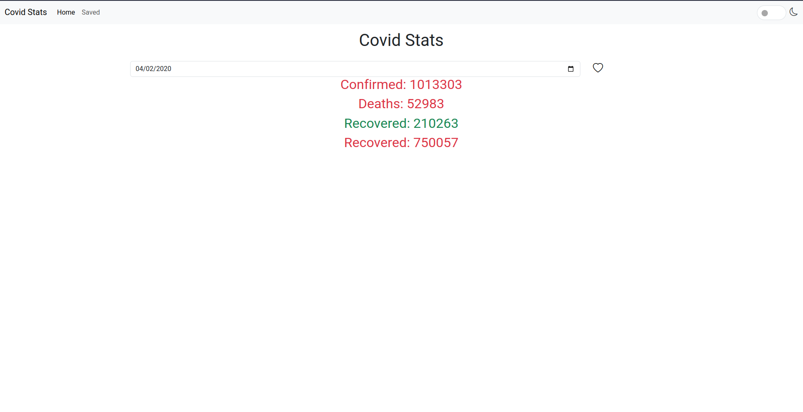

### Running the project

```bash
git clone https://github.com/StanMathers/react-finals-project
```

Go to the downloaded directory

- Install dependencies

```bash
npm install
```

- Run the project (in development mode)

```bash
npm run dev
```

- Run the project (in production mode)

```bash
npm run build
npm run start
```

### Note:

Project contains animations, validations and more which can not be seen in the images below.

## Screenshots

### Home Page




### Saved


### Modal


### Saved details


